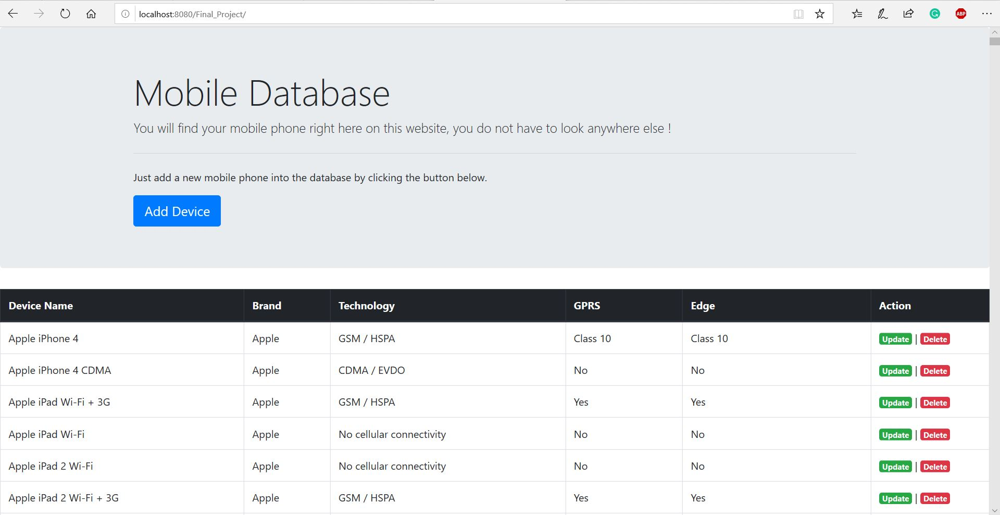

# Mobile Description Web Application

>**_Thank you for going through my GitHub repository!_** 

## Overview 
<br>


<br>
<br>

## Data Extraction:

In this phase of the project, I acquired data which was going to be forwarded to the web application.<br> 
The libraries used for this task were [Pandas](https://github.com/pandas-dev/pandas) and [FonoApi](https://github.com/shakee93/fonoapi). 
<br>The steps I followed were:
1. Acquire token from [link](https://fonoapi.freshpixl.com/)
1. Collect the names of the features from FonoApi with the help of the acquired token. 
1. Automate data insertion with the help of python, one phone at a time. 

## Data Sink:

The resultant data frame from the Data Extraction phase can be exported as an excel file. 
The next task was to put the data collected into a readable format for the Web Application backend. 
After considering various options, I decided to move forward with the [MySQL](https://www.mysql.com/) environment. 
<br>
The steps I followed were:
1.	Create a database for in your desired database environment. 
2.	Initiate a database engine with [sqlalchemy](https://github.com/sqlalchemy/sqlalchemy)
3.	Utilizing the initialized engine, insert the data extracted into the database environment. 
4.	Once data is successfully inserted, alter the data table with the help of SQL queries.
<br>
The python files and the data file can be found within the ```Python Code and Data Files``` directory.
The SQL queries can be within the ```scripts_of_changes.sql``` file.

## Web Application
This phase of the project was developed with the help of [Java Servlets](https://en.wikipedia.org/wiki/Java_servlet) and [JavaServer Pages(JSP)](https://en.wikipedia.org/wiki/JavaServer_Pages). 
[Bootstrap](https://github.com/twbs/bootstrap) was used for the front end of this web application. 
<br>
The functionalities of this web application are as follows:
*	Update or delete the mobile features into the web application. 
*	Manually new phones can be added with the help of Add Device button.
*	All transactions will be executed on the database when the Save button is clicked on the web application. 


## Screenshots
### Homepage


<br>
<br>

### Add New Device Page 


### Update Mobile Data Page 


